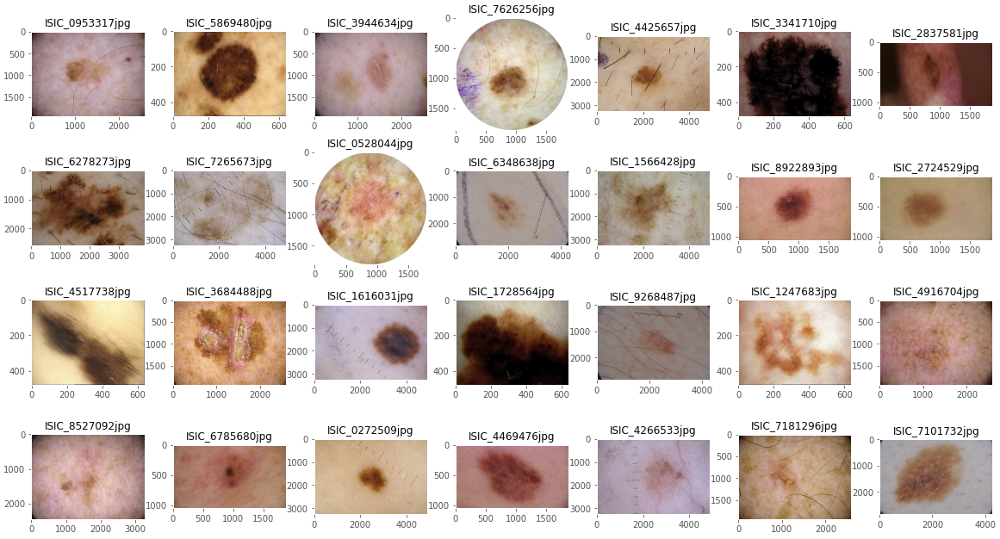
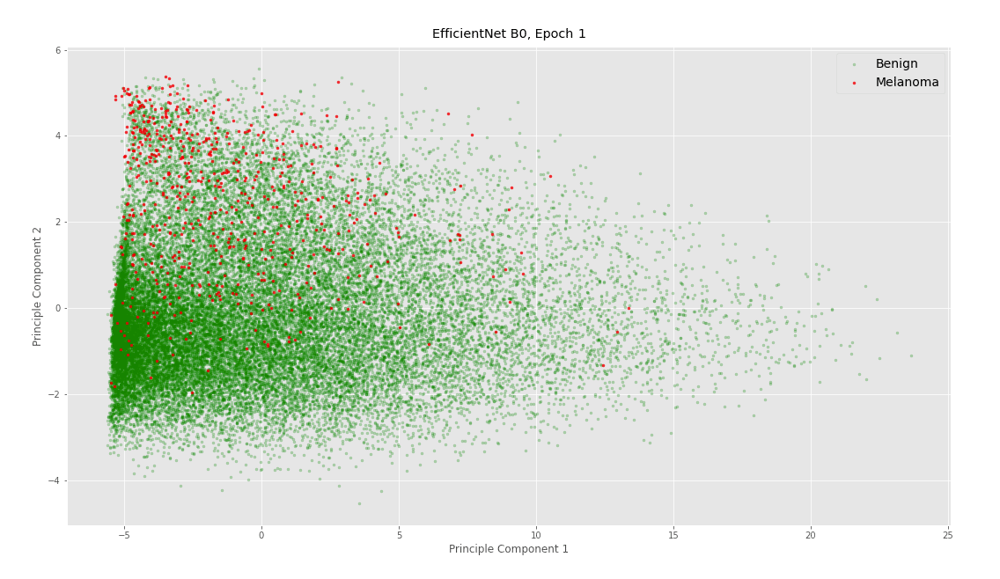

# Classifying Melanoma
**Models**: EfficientNet (CNN), Logistic Regression, SVM, PCA, Focal Loss  
**Tech Stack**: TensorFlow, Keras, Scikit-learn, TPU, GCS      

The project is an attempt to compete in the [Kaggle competition](https://www.kaggle.com/c/siim-isic-melanoma-classification) using machine learning techniques to identify melanoma in images of skin lesions. The overall workflow is iterative in nature with trials and errors: 

Note that the deployment in this study involves a simple submission to Kaggle's leaderboard submission with the required formats. Over the course of the study, a total of three models using neural network and two baseline models are built:

- **Neural Networks**
  - **v1**: CNN, 3-Layer
  - **v2 (Best Model)**: EfficientNet with Focal Loss & Data Augmentation
  - **v3**: Concatenated Neural Nets, EfficientNet (for Images) + Neural Network (for Patient Metadata)
- **Baseline Models**
  - Logistic Regression
  - Support Vector Machine

Lastly, an [additional exploratory study](https://github.com/yintrigue/portfolio-ds/tree/master/neural_net_visualization) that visualizes the learning progress of EfficientNet using PCA to reduce the embedding's dimension is conducted. 

## Datasets

Two datasets are used for the classification: a **CSV (~2MB)** that contains textual patient metadata, and an **image pool (40GB+)** that consists of 33,126 skin lesion photos, of which there are **only 584 positive examples**. Both datasets can be downloaded on Kaggle's competition page, [SIIM-ISIC Melanoma Classificatio](https://www.kaggle.com/c/siim-isic-melanoma-classification/data). A number of major challenges are presented by the two datasets:

- Extreme class imbalance, with only 1.76% of the examples being positive
- Raw data come with a large size (40GB+) in two distinct structures: images and text-based metadata
- Image inconsistency (e.g. hair, crop, zoom, aspect ratio, unexpected objects, etc. ), as demonstrated by the sample below.

A detailed description on the issues and resolutions can be found in the notebook, [model_nn_v3_efn_meta.ipynb](./mdoels/model_nn_v3_efn_meta.ipynb). 

## Evaluation Metrics

The primary metric for the study is, **ROC AUC**, which is the official leaderboard metric for the Kaggle competition. It is also a common measurement for clinical research due to the advantage that the classification threshold can be adjusted accordingly given the specific trials being conducted. However, as noted, the extreme imbalance in our dataset (with only 1.76% of the examples being positive) could lead to an overly optimistic ROC AUC. ROC AUC also does not reflect the performance on false positive classification, which is crucial in practice considering how deadly the consequence of a wrongly diagnosed cancer could be. 

As such, the secondary metrics for our study are **precision** and **recall**. Given that both false positive (wrongly diagnosed cancer) and false negative (undiagnosed cancer) melanoma can be harmful and even deadly, we prefer observing precision and recall individually instead of using an aggregated metric such as F1 or PR AUC.

## Baseline Models

Two models, Logistic Regression (LR) and SVM, are built as baselines. While both LR and SVM achieve 97%+ accuracies with minimal effort on fine-tuning, the two models perform extremely poor on recalls and precision. In particular, LR achieves a mere 0.52 ROC AUC, and SVM's precision and recall are low at 0.07 and 0.05 respectively. This discrepancy between accuracy and AUC/precision/recall is due to the the imbalance between positive and negative examples in the dataset. With only 584 out of 33,126 examples being positive, a 98.23% accuracy can be easily achieved by predicting all patient cases to be positive.

## CNN Specifications

**Model v1** is a simple CNN with two hidden layers and dropouts. Minimal feature engineering and model fine-tuning was performed. The goal is to see how well a basic CNN can handle the Melanoma dataset. 

**Model v2** (best model) is built on EfficientNet with a number of key improvements:

- Data
  - Improved **feature engineering** (including cropping, compression, and duplicate removal) is performed based on **EDA**.
  - Data augmentation is implemented to reduce overfitting.
- Model
  - Two additional **baseline models** (Logistic Regression and SVM) are built as comparisons.  
  - **EfficientNet** with transferred learning is implemented instead of a simple 3-layer neural net.
- Training
  - **EfficientNet** B0 to B7 with transferred learning and various hyperparameters are experimented using **5-fold CV** for fine-tuning the performance.
  - **Focal Loss** (a custom loss function [published by Facebook](https://arxiv.org/abs/1708.02002) for binary classification) is applied to address the issue of class imbalance in the dataset.
  - Model is built and trained on **TPU** to improve training efficiency.

In addition, Model v2 makes the final prediction using **bagging** by averaging the 50 probabilities (10 augmented variations x 5 models) for each example in the test dataset. In practice, an architecture as such can be relatively inefficient in prediction time comparing to as each prediction requires 50 probabilities to be computed. However, we argue that performance (i.e. precision & recall) should be prioritized in this case because an undetected or wrongly detected cancer can be deadly.

**Model v3** combines the output embeddings from Model v2 with a second neural network specifically for metadata to produce the final predictions. 

Specifications for **Model v3** are:

- **Feature Engineering (Images)**
  All images are cropped to squares with the same dimension. Random augmentation with the following adjustments (using TensorFlow's image library `tf.image`) are applied at runtime prior to entering the model for training or prediction.
- **Feature Engineering (Metadata)**
  - All data are transformed by one-hot. All missing values are given a value of -1. There are a total of 18 inputs after the one-hot transformation.
  - The strategy is based on the assumption that missing data are random by nature (i.e. no strong correlation to an example's class). By consistently assigning an unique value to missing data, the neural network should be able to learn the insignificance of the variable.
- **Convolutional Neural Network**
  The architecture of CNN stays exactly the same as Model v2. EfficientNet B0 is chosen in Model v3 simply for its efficiency for training.
- **Neural Netowrk for Metadata**
  Both hidden layers (highlighted in blue) consists of 64 neurons with relu activation and batch normalization. The dropout rate is set to 0.4. The specifications are chosen purely by experiment.
- **Concatenation**
  The dense layer consists of 512 neurons with relu activation and batch normalization. The number of neurons is roughly half of the features after the concatenation.

## Results

**Model v1** produces poor results. With 20 epochs of training, ROC AUC is still close to 0.50 with limited number of positive examples being identified.

**Model v2** (our best model) achieves an AUC of 89.05 on the test set with 20 epochs of training. Given the close performance between training and validation, we believe that there is room for improvement on performance with more epochs of training. Unfortunately, our training is limited to 20 epochs for the time being with the resources available. The specs that produce the best result for Model v2 is summarized below:

- Model: EfficientNet B7 
- Transferred Learning: ImageNet
- Loss Function: Focal Loss
- Epochs: 20 (Best Model at 16th Epoch)
- Batch Size: 64
- Image Size: 256x256
- Random Image Augmentation: True

Note that the final model used to predict the test set (i.e. predictions for the leaderboard submission) was trained using full 33,126 training examples without a validation set. While re-training the model on the full dataset without validation can be uncommon in practice, it can be justified by the extreme rare positive examples in the dataset. The model benefits from learning the full 584 positive examples. A better approach, however, is to re-train the same best model using 5-folds, and use all 5 models for the final prediction. This method is adopted in Model v3.

The best model specified above achieves the following performance results:

|           | Train | Valid | Test |
| --------- | :---: | :---: | :--: |
| AUC       | 0.87  | 0.85  | 0.89 |
| Recall    | 0.53  | 0.51  |  -   |
| Precision | 0.62  | 0.63  |  -   |

**Model v3** suffers from severe overfitting with only 10 epochs of training (best model at 5th epoch), so much so that the model is able to achieve a nearly perfect AUC score despite the extremely poor results on the validation dataset. We suspect that there might be a data leakage associated with the metadata in the training set although great care has been taken care of to avoid leakage.   

|           | Train | Valid | Test |
| --------- | :---: | :---: | :--: |
| AUC       | 0.96  | 0.71  | 0.72 |
| Recall    | 0.93  | 0.15  |  -   |
| Precision | 0.83  | 0.36  |  -   |

**Future Works**: Model v2 and v3 suffer from different issues and require different treatments. Model v2 (underfitting) would benefit from additional training time while Model v3 (overfitting) requires investigation on data leakage and could benefit from a reduced complexity/scale of neural network and/or stronger regularization. Ensemble that combines multiple models could help improve the performance in both cases. Other potential improvements include:      

- Additional Feature Engineering
    - Hair simulation (EDA shows that lesions are frequently covered by body hair)
    - Microscope vignette simulation (EDA shows that multiple images come with strong vignetting and/or round-shape cropping)
    - Taining with higher image resolutions
    - Experiment with different metadata after resolving leakage
- Additional Hyperparameters Fine-tuning
    - Random/grid search
    - Learning rate decay

## Additional Study: Visualizing EfficientNet

As an extension to the modeling, the learning progress of EfficientNet B0 is visualized by reducing the neural net’s embedding dimension using PCA. A more detailed description of the analysis can be in the repo [here](https://github.com/yintrigue/portfolio-ds/tree/master/ml_visualizing_neural_net).  

## Repository 

- [`./models/`](./modes/) contains all source codes for the three models.
- [`./models/model_nn_v3_efn_meta.ipynb`](./models/model_nn_v3_efn_meta.ipynb) is the notebook with the final writeup and complete source codes for Model v3. 
- [`./model_nn_v3_efn_meta.ipynb`](./model_nn_v3_efn_meta.ipynb) contains all source codes and the final report write-up.
- [`./ppt/melanoma_ppt.pdf`](./ppt/melanoma_ppt.pdf) is a presentation that discusses the technical aspects and performance results of the study.
- `./saves/` contains the saved models and performance evaluation results from the final model. 
- `./_img` contains the images used for the writeup and readme markdown.  